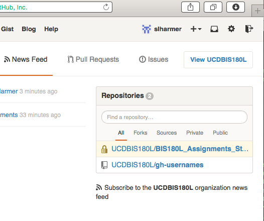
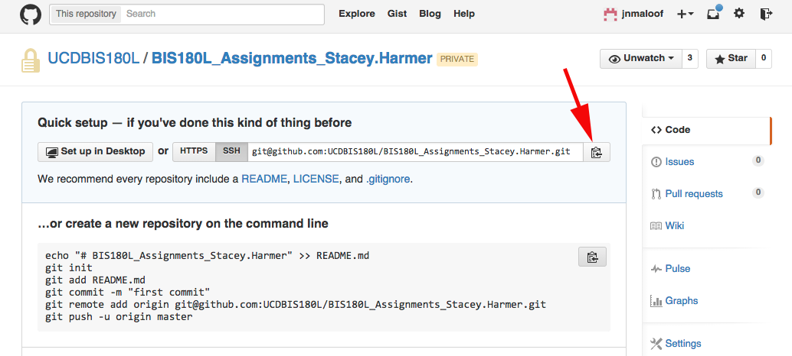
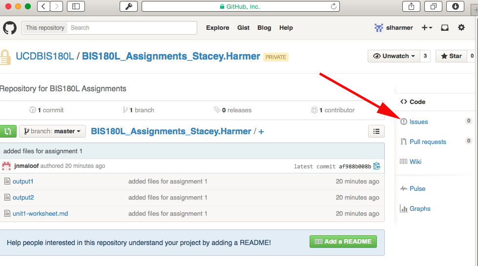
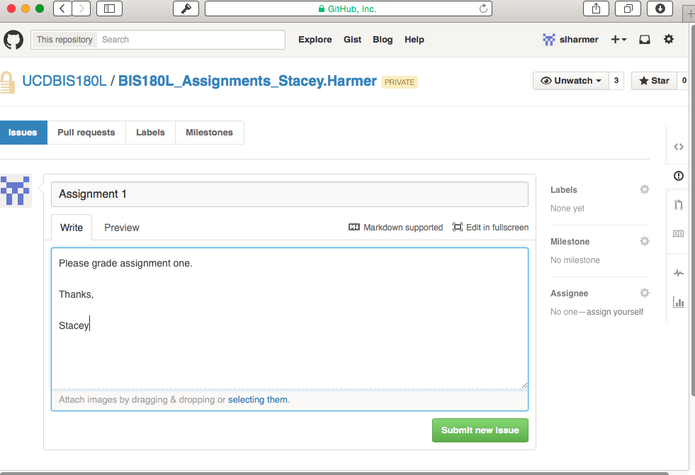

How to turn in Assignments
========================================================
author: Julin Maloof
date: April 07, 2015

I need your GitHub Username
========================================================

I am missing usernames for:

Daniel Aherns    
Samuel Deck  
Anjali Kadakia  
Khoa Nguyen 
***
Scot Nicol  
Nabeel Sami  
Pallavi Setty  
Gurkern Sufi  
Igor Hiroshi Terayama de Oliveira

To give me your GitHub Username:
========================================================

* Fork the gh-usernames repository
* Clone it to your computer
* Modify the `gh-usernames.md` file
* Add your changes
* Commit your changes
* Push back up to GitHub
* Send me a pull request (from the web browser)

See GitHub assignment from last Thursday.  If you need help please ask.

Assignment turn-in
========================================================
incremental: true
Assignments are to be turned in by pushing to a github repository

I have created a private GitHub repository for each of you

Short version:
* Clone the repository
* Create a directory in the repository "Assignment 1"
* Copy your markdown file into the directory
* Add the file to be tracked
* Commit the change
* Push to github
* On the webpage for your repository create an issue "Please Grade Assignment 1"

Step-by-step guide for assignment turn in
===================
type:section

Clone the repository--part I
=====================

This only needs to be done once
* go to GitHub.com and logon
* If you haven't already done so, accept the invitation to join the UCDBIS180L team
* Click on the link "UCDBIS180L/BIS180L_Assignments_..." link on the right hand side



Clone the repository--Part II
==============================

* Click on the button to copy the "clone" link to your clipboard


Clone the repository--Part III
===============================
* Go to terminal type `git clone` and then paste in the address.  It will look something like


Create a directory and move files
=================================

* `cd` into the repository (Change Stacey.Harmer to whatever is correct for your repo)
* make a directory for the assignment and change to it
* move the relevant file(s) to the directory.  (This will vary depending on where your files are)


```r
cd BIS180L_Assignments_Stacey.Harmer
mkdir Assignment_1 
cd Assignment_1
mv ~/Documents/BIS180L_Lab1/* ./
```

Check status; Git to track the files
====================================


```r
git status
git add ./* #adds all files
git commit -m "added files for assignment 1"
```

Continue working and committing
================================

Continue to work on the assignment

And and then commit new changes whenever you change something significant

Push to GitHub
==============

When you are ready to submit push your changes to GitHub

First set your git configuration options (only needs to be done once per machine)  


```r
git config --global push.default simple
```

Then

```r
git push
```

Of course you can push before this also.  Just be sure to push one final time when you have completed your work.

Create an issue
===============

To tell us that you are ready for us to grade your assignment
* go to the github webpage for this repository
* click on "issues"



Create an issue, 2
=====================

* create a new issue "Assignment 1"

* tell us that you are ready for your assignment to be graded


Optional Lab Exercise
====================
type: section

Automating commands in the bash shell script
============================================
See new lab exercise for today (in "labs" on website)

This is optional but recommended.


